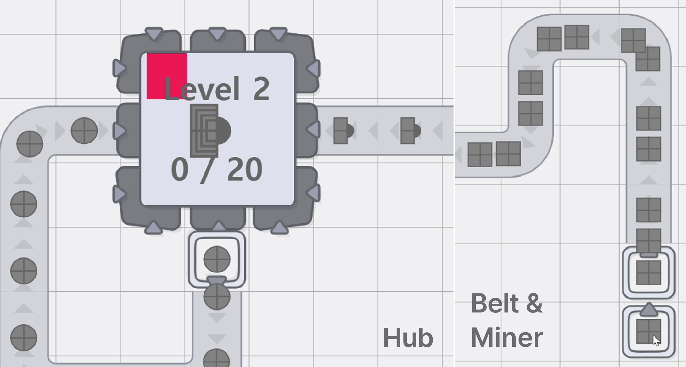

**Shapez mini**

Name: Lee Nak Hyeong

Student ID: 20200437

Email: nhl0113@kaist.ac.kr

Demo video: [link](https://youtu.be/EEtSwftlagE)

Repository URL: [link](https://github.com/NakJiTangTang/Shapez-mini)

 
 
## Table of Contents

- [Table of Contents](#table-of-contents)
- [Description](#description)
- [Game goal](#game-goal)
- [Core mechanics](#core-mechanics)
  - [Coordinate system](#coordinate-system)
  - [Building blocks](#building-blocks)
  - [Basic buildings](#basic-buildings)
  - [Modification buildings](#modification-buildings)
  - [Balancer](#balancer)
  - [Example](#example)
- [Organization of project](#organization-of-project)
  - [Basic structure](#basic-structure)
- [Highlight](#highlight)
  - [Implementing methods (Hard parts)](#implementing-methods-hard-parts)
  - [Bugs](#bugs)
- [References](#references)


## Description


Shapez-mini is a project that implements the basic elements of the original game based on **node.js, p5.js and p5.play**.

Original game: Shapez is construction management simulation io game released on May 21, 2020. As its name suggests, Shapez is a game that consists of a factory that extracts shapes, cuts and combines shapes, and colors them to produce various shapes. It is [open-sources](https://github.com/tobspr-games/shapez.io) games. 


## Game goal


The main objective is to **design and build factories to produce specific Shape**. The game starts with a field of Ores and the Hub, and players must gather materials(from mining ore), construct  production lines(cut, rotate, merge, stack, paint), and create production lines to manufacture different items.

There is no strict win and lose in this game. As players progress through the game, they encounter more complex shapes to make, which require more advanced and efficient production processes. 

But what the player should consider is **optimization**, since each level need a amount of target shapes. To avoid boring long waiting, the ultimate goal is to create a highly optimized and automated factory. And the sense of accomplishment that occurs when succeeing in this becomes the motivation of the game.

## Core mechanics

### Coordinate system

   All building follows [n, m] lattice coordinate. [refX refY] of Player's viewpoint is equal to Origin of [x, y] coordinate. [n, m] lattice coordinate is represented in the form of index of buildings array by nmIntoIndex([n, m]).

### Building blocks


The operation of the game is carried out through the **mouse and keyboard**. Player can install and delete buildings in the field with mouse, and the keyboard allows them to select the building or status (Drag/Rotate/Erase). For example, while pressing space bar, player can discover field by dragging.


The game basically consists of elements of **Shapes**/dyes and building that transports/processes them. **The basic operating element of the game is each building**. The building attempts to manipulate the shape it received and hand it over to the next building. If the building in the direction is already jam, it's become jammed for itself.
For example, each Shape on the belt can move only when there is _no traffic jam_.


### Basic buildings


The **Belt** literally moves the shape visually in the next direction. It can be arranged using two methods: drag along path and click (same as others).

The one in the middle of the start screen is **Hub**. Hub is the final destination for all shapes, indicating the current level and the shape and number required. Once the task is completed, it will move on to the next stage.

The fields are strewn with ores. By placing **Miner** on the ore tile, each Shape same as ore pop out. Player can connect the Miner and Hub using belts, through simpy dragging along the path. This completes the simplest interaction to clear the level by the above three buildings.

### Modification buildings
To make wanted shape, player should build their own production line by combining various buildings.


- For one elements: Cut in half/quad, Rotate, Paint
- For two elements: Merge, Stack


The **Rotator** exports the received shape by turning it 90 degrees to the right.
**Cutter** splits the received shape left and right to create two new shapes. Connecting just one of the two output terminals will not stopping, but both output terminals stop when Jam occurs in both.

The **Painter** receives the Dye element, saves it, and colors when the Shape element comes in. Therefore, if the production of the shape element is higher than the speed at which the dye element is produced, there may be uncolored/no-color-changed blocks.

One of the most important buildings is the **Stacker**, which plays the **role of stacking and merging** according to the two incoming elements. By default, place the shape on the right over the shape on the left. However, if it is possible to paste all the same-height layers of both shapes into one layer (no overlapping parts), then combine the same-height layers. Since changes due to Stack are irreversible, so the player needs to consider.

### Balancer


Unlike other buildings, **Balancer** does not change the Shape. Instead, **it adjust the flow of the shape in two modes**. If there is one input and then two rails, the output is distributed alternately between the two rails. If there are two inputs and one output rail, all input Shapes will be placed on that rail. In the case of the former, it is used when one shape has to be used in many places, or when it is hard to manufacture in many places because it is a complex shape. In the latter case, it is for the cases when need to make various shapes on one rail, or simply speed up production.

### Example

As the stage changes, the Shape required becomes increasingly complex.


As shown in the picture above, by installing seven kinds of buildings, player can create the shape that the hub needs.


## Organization of project

### Basic structure


The overall structure is divided into **Field, Building, and Element (Shape)**. Element represents each shape with a total of four layers & color on it. Building is responsible for modifying and exporting elements. Field is the space where Building can be built, and the element is propagated through communication between Field objects and Building objects.

Field have **buildings**, the array of building
Each building have a **queue** as a property inside. 
The queue contains objects of element class.

The Building has a **one-tile** regular building and a two-tile **Dualbuilding**. In fact, Dualbuilding does not really occupy two spaces, but consists of Origin building and Counterpart. This Counterpart may or may not receive input depending on the setting. If it receive the input, store the element in the **queueCounter** of Origin building. In Dualbuilding, the output is in charge of whatever number it is in Origin building.


Basically, the element movement is all based on OOP. Classes were created using 'extends Subject', and communicate with each other through notifySubscriber and update. Element class have a **"movingpercent"** as a property, and also a sprite object (p5.play).
In every frame, every building inside the buildings increase the "movingpercent" of elements in queue.

If the largest movingpercent become 100, each building alarm (by notifysubscriber) Field it(element)'s (desired direction, own lattice location, next lattice coordinate,Element).
Then field check the next tile, and if it is empty or already jammed, alarm that building that **you're also jammed**. If building is jammed, no function processed. (building and field is simultaneously subscriber). Else, the element will be normally transferred to the next building.


## Highlight

### Implementing methods (Hard parts)
1. safeSpriteVisibility in Element
The sprite class provided by p5.js is definitely convenient, but there was a fatal drawback in this project. That's where it's going to be deleted if it's outside the area defined on the canvas.
Therefore, to prevent this, unlike the original coordinates, **Sprite actually remains in the canvas**, but it was implemented in such a way that it was only set to be invisible and then visible again when it returned.
```Javascript
let putX = X;
let putY = Y;
if (Y>-R && Y<height+R && X>-R && X<width+R ){
    this.safeSpriteVisible=true;
}
else{
    if(Y<=-R || Y>=height+R){putY= (Y<=0) ? -R : height+R;}
    if(X<=-R || X>=width+R ){putX= (X<=0) ? -R : width+R ;}
    this.safeSpriteVisible=false; 
}
this.sprite.pos ={x:putX, y:putY};
```

2. Element into String
In the case of Hub, it had to compare the elements that came in with each other and store the numbers. The problem was how to dataize an element, and I overcame it by using toString to create a unique string for each shape.
Therefore, I tried to make it easy and intuitive by creating a key-value pair in which the **characteristic string is key** and the quantity is value in the 'storage' object.
```Javascript
movingElem(){
  if (this.queue.length){
    for (let element of this.queue){
      let layers = [...element.layers];
      let layersStr = [];
      for (let layer of layers){
        if(layer){
          layersStr.push([...layer.color, ...layer.shape].toString()) 
        }else {layersStr.push(0)};
      }
      let data = layersStr.toString();
      if (this.storage[data]){this.storage[data]+=1;} 
      else{this.storage[data] = 1}
      this.queue.shift();
    }console.log(this.storage);
  }
  this.levelWorking();
}
```

3. Global [parameter](./src/Constants.js) 
One can manage constants such as size of elements  and overall speed in one place. Also, one can manage the [Ore](./src/OreList.json) of the field and  [levels](./src/Level.json) respectively.

### Bugs
1. Sprite blink when using Cutter 
When the output goes toward the counterpart of the cutter, the position of the sprite blinking. It doesn't affect gameplay, but it can be eye-watering. It is presumed that it happened because the code was twisted on the side of the element.
2. (Very rare) The Shape of the Hub is gone
If player drag the screen around in a zoomed-in situation, there are times when the shape of the Hub disappears. At this time, there is no way to fix it except for refresh. 

## References
- [p5.js](https://p5js.org/ko/reference/)
- [p5.play](https://p5play.org/learn/)
- [window.keydown](https://velog.io/@eunjin/Javascriptwindow.addEventListener-keypress-keydown-%EB%AC%B4%EC%8A%A8-%EC%B0%A8%EC%9D%B4%EC%9D%B8%EA%B0%80%EC%9A%94)


